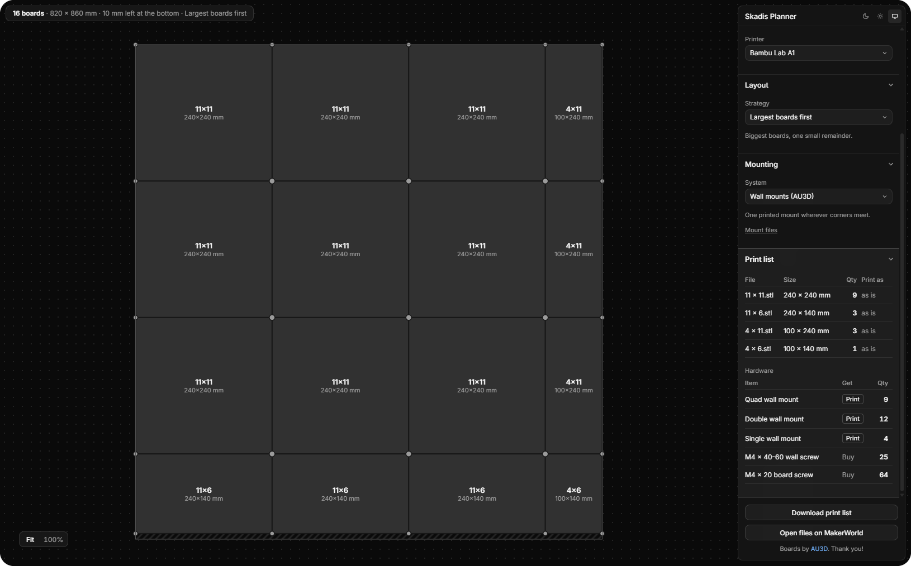

# Skadis Planner

Plan a wall of 3D-printed IKEA Skadis boards. Enter the width and height of
the space, pick a printer and a mounting system, and get the fewest boards to
print, sized to your printer's bed, with a print list and the hardware to
fix them.

First model: [IKEA Skadis Infinity](https://makerworld.com/en/models/1309689-ikea-skadis-infinity) by AU3D.

  

## Run

    npm install
    npm run dev       # http://localhost:5173
    npm test
    npm run build     # static output in dist/

## Add a board model

1. Copy `src/models/skadisInfinity.ts` to a new file and fill in the fields
   of `BoardModel` (see `src/models/types.ts`).
2. Add it to `MODELS` in `src/models/index.ts`.

The solver assumes `sizeMm(holes) === pitchMm * (holes + 1)`.

## Add a printer

Add an entry to `PRINTERS` in `src/printers/index.ts`.

## Credits

Everything this tool plans for is by [AU3D](https://makerworld.com/en/@AU3D) on MakerWorld:
the [IKEA Skadis Infinity](https://makerworld.com/en/models/1309689-ikea-skadis-infinity) boards,
the [Multi Board Wall Mount](https://makerworld.com/en/models/861073) and
[Single Wall Mount](https://makerworld.com/en/models/420877), and the
[Screw Spacers](https://makerworld.com/en/models/418874). Thank you!
This tool only plans which of the author's files to print; download the files from
MakerWorld under the author's licence. Nothing from the models is redistributed here.

## Layout

- `src/models`, `src/printers`, `src/units.ts`: data and conversions.
- `src/solver`: pure planning. `plan()` splits each axis into the fewest
  boards, prefers symmetric boards, then computes mirror flags and groups.
- `src/ui`: React + StyleX. `planState.ts` turns the form into a plan.
- The UI follows Toolcraft's design direction (https://toolcraft.sh): a dark
  canvas-first workspace, a floating controls panel, Inter, and a neutral
  geometry ladder for the preview. Tokens live in `src/ui/tokens.stylex.ts`
  and `src/ui/mixes.stylex.ts`; the light theme in `src/ui/themes.stylex.ts`.
  Theme preference is stored under `appearance.theme.v1`.
